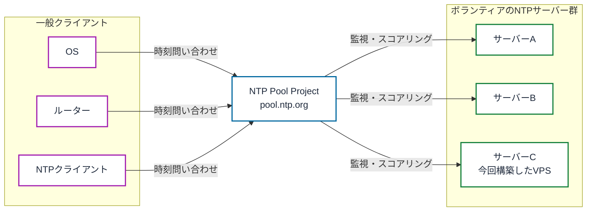
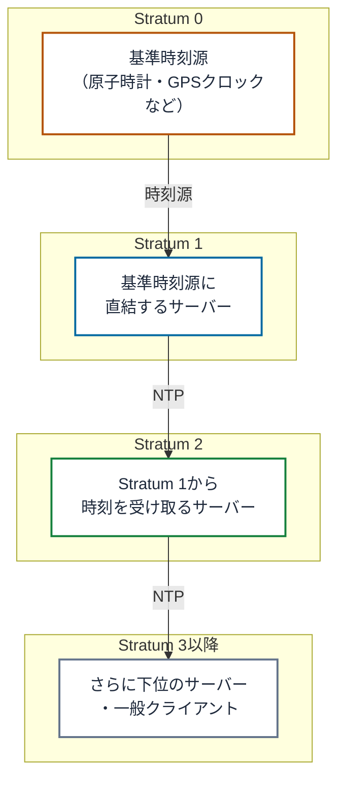

## はじめに

みなさんは、NTP Pool Projectを知っていますか？
個人がボランティアとしてNTPサーバーを提供することができるプロジェクトです。

今回、私はNTPサーバーをさくらのVPS上に構築し、NTP Pool Projectにサーバーを登録し、構築手順をさくらのVPSの「スタートアップスクリプト」として公開する、という流れを実践してみました。
本記事は、その過程を実際のコマンドを交えて記録しておくものです。

## NTP Pool Projectとは？

NTP Pool Project（ntppool.org）は、世界中のボランティアがNTPサーバーを提供するプロジェクトです。
各NTPサーバーをPoolという単位で束ね、一般のクライアントに無償で時刻同期先を提供します。

そもそも、NTP（Network Time Protocol）というのは各コンピューターを協定世界時（UTC）に同期させるプロトコルのことです。
一般的なクライアントサーバシステムの構成で、クライアントがネットワーク上のNTPサーバーに時刻を教えてもらう感じです。

クライアントは`0.jp.pool.ntp.org`のようなドメインに問い合わせることで、Pool内のNTPサーバーのいずれかのIPアドレスを取得できます。
自分でNTPサーバーを用意し、サーバーをPoolに登録することで、Poolに参加して配信対象になることができます。



NTPでは、時刻の精度をstratum（階層）という数値で表すことを覚えておきましょう。

stratum 0は原子時計やGPSクロックなどの基準時刻源、stratum 1はそれに直結するサーバー、stratum 2はstratum 1から時刻を受け取るサーバー、という形で数字が大きくなるほど基準時刻源から遠くなります。



> 数字が大きいほど基準時刻源からの経由段数が増え、精度は緩やかに低下する。


chronyはNTPクライアント・サーバーの実装の一つです。
NTP Poolサーバーとしての運用でもよく使われています。

## 検証環境

- VPS: さくらのVPS（石狩リージョン、2vCPU / メモリ1GBプラン、2週間無料お試し）
- OS: Ubuntu 24.04 LTS

## chronyのインストール

Ubuntu 24.04では、`chrony`パッケージをインストールするとデフォルトの`systemd-timesyncd`から自動的に置き換わります。

```
$ sudo apt update && sudo apt install -y chrony
```

## chrony.confの設計

上流サーバーには、日本国内の安定したstratum 1/2サーバーとして、NICT（`ntp.nict.jp`）とmfeed（`ntp1`/`ntp2`/`ntp3.jst.mfeed.ad.jp`）を採用しました。

編集前に、念のため`/etc/chrony/chrony.conf`のバックアップを取っておきます。

```
$ sudo cp /etc/chrony/chrony.conf /etc/chrony/chrony.conf.backup
```

`/etc/chrony/chrony.conf`を以下の内容に書き換えます。

```
server ntp.nict.jp iburst minpoll 6 maxpoll 10
server ntp1.jst.mfeed.ad.jp iburst minpoll 6 maxpoll 10
server ntp2.jst.mfeed.ad.jp iburst minpoll 6 maxpoll 10
server ntp3.jst.mfeed.ad.jp iburst minpoll 6 maxpoll 10

driftfile /var/lib/chrony/chrony.drift
makestep 1.0 3
rtcsync
logdir /var/log/chrony
leapsectz right/UTC

# 全クライアントからの時刻問い合わせを許可（NTP Pool参加のため）
allow

# レート制限（DDoS反射攻撃対策）
ratelimit interval 1 burst 16 leak 2
```

主な設定項目の意味は以下の通りです。

- `iburst`: 起動直後に複数のリクエストを連続送信し、同期を早める
- `minpoll` / `maxpoll`: サーバーへの問い合わせ間隔（2の階乗秒）の下限・上限
- `makestep 1.0 3`: 起動直後3回の時刻更新に限り、1秒を超えるずれを即座に補正する（それ以降は緩やかな補正のみ）
- `rtcsync`: システム時刻をハードウェアクロック（RTC）にも反映
- `leapsectz right/UTC`: うるう秒の扱いをtzdataの定義に委ねる
- `allow`: NTP Poolサーバーとして、全クライアントからの問い合わせを許可
- `ratelimit`: リクエストのレート制限。DDoSの踏み台にされることを防ぐ

設定を反映するため、chronyを再起動します。

```
$ sudo systemctl restart chrony
```

設定後の同期結果は以下の通りです。

```
$ chronyc tracking
Reference ID    : 85F3EEA4 (ntp-b3.nict.go.jp)
Stratum         : 2
System time     : 0.000002208 seconds fast of NTP time
Leap status     : Normal

$ chronyc sources -v
^* ntp-b3.nict.go.jp             1  10   377   282   -553us[ -551us] +/- 8947us
^- ntp1.jst.mfeed.ad.jp          2   9   377   158   +750us[ +750us] +/-   32ms
^- ntp2.jst.mfeed.ad.jp          2   7   377   231   +788us[ +788us] +/-   34ms
^- ntp3.jst.mfeed.ad.jp          2   8   377    28  +2851us[+2851us] +/-   51ms
```

## ファイアウォール設計

ファイアウォールは、さくらのパケットフィルターとOS側（ufw）の二重管理を避けるため、さくらのパケットフィルターを無効化し、ufwに一元化する方針としました。

```
$ sudo ufw default deny incoming
$ sudo ufw default allow outgoing
$ sudo ufw allow 22/tcp
$ sudo ufw allow 123/udp
$ sudo ufw enable
Command may disrupt existing ssh connections. Proceed with operation (y|n)? y
$ sudo ufw status verbose
Status: active
22/tcp                     ALLOW IN    Anywhere
123/udp                    ALLOW IN    Anywhere
22/tcp (v6)                ALLOW IN    Anywhere (v6)
123/udp (v6)               ALLOW IN    Anywhere (v6)
```

## 外部疎通確認

自宅のPCから、VPSのグローバルIPに対してNTPクエリを実施しました。

```
$ chronyd -Q "server <VPSのグローバルIP> iburst maxsamples 1"
System clock wrong by -0.001940 seconds (ignored)
```

オフセット-1.94msという結果で、UDP 123番が外部から到達可能であることを確認しました。

## NTP Pool Projectへの登録

登録は、おおまかに次の流れで進めます。

1. [NTP Pool Project](https://www.ntppool.org/ja/)のサイトでアカウントを作成する
2. 管理画面（MANAGE SERVERS）の「Add my server」からNTPサーバーのグローバルIPを登録する
3. NTPサーバー上で認証用のURLにアクセスして所有権を証明する
4. Net speedを設定する

### 1. [NTP Pool Project](https://www.ntppool.org/ja/)のサイトでアカウントを作成する

Webサイトに訪問し、アカウントを作成しましょう。

### 2. 管理画面（MANAGE SERVERS）の「Add my server」からNTPサーバーのグローバルIPを登録する

「Add my server」の下に以下の注意書きがあります。

`Please, only add your own servers. If you want another server to be added, contact the owner/administrator of that server and encourage them to add it to the pool. That goes even if the server is listed as a public server!`

自分が契約・管理しているVPSであれば登録対象になります。他人が公開しているNTPサーバーを無断で登録することはできません。

### 3. NTPサーバー上で認証用のURLにアクセスして所有権を証明する

サーバーを登録後、「NTP Servers」という項目が表示されると思います。
これが自分のNTPサーバーに関する情報です。

ここにある`Unverified`と書かれたボタンをクリックすると、認証用のコマンドが表示されます。
サーバー本体からcurlもしくはwgetで認証用URLへアクセスすることで、サーバーの所有権を証明する仕組みです。

```
$ curl --interface <VPSのグローバルIP> https://validate4.ntppool.dev/p/
To verify this server with the NTP Pool, visit
https://manage.ntppool.org/manage/server/verify/<認証用トークン>
```

表示されたURLにアクセスすることで認証が完了します。

### 4. Net speedを設定する

Net speedは実際の回線帯域の申告ではなく、Pool全体のDNS配信における相対的な重みです。
数値を上げるほど、DNS応答に含まれる頻度（＝受け持つクライアントトラフィック量）が増えます。

NTPパケットは1つ90バイト程度でCPU負荷はほぼ無視できるため、ボトルネックは帯域・通信費用側になります。突発的なトラフィックのスパイクに余裕を持たせるため、実回線の帯域より低めに申告するのが一般的です。
まずは、512Kbitなど低めの値にしておくのが良いと思います。

登録直後は`Current score: 0.0`が正常な初期状態です。
認証完了後、スコアが蓄積されていきます（10を超えるとDNS配信対象に含まれます）。

> 翌日に確認したところ、スコアはすでに19.4まで上がっていました。


## マイスクリプトとして公開

上記のNTPサーバー構築を自動化するスクリプトを、さくらのVPSの「スタートアップスクリプト」として公開しました。

Ubuntu 22.04/24.04、Rocky Linux 8/9/10、AlmaLinux 8/9/10に対応しており、VPSを新規契約する際にこのスクリプトを選択するだけで、同様の環境を再現できます。
> 「chronyによるNTPサーバー構築」という名前で公開しています。

## まとめ

さくらのVPS上にchronyによるNTPサーバーを構築しました。
思っていたよりも早くNTP Poolのスコアが10に到達し、なんだかうれしいです。
今後はスコアの推移を見ながら、Net speedの調整や上流サーバー構成の見直しを行っていく予定です。

## 参考

### NTP Pool Project

- [NTP Pool Project](https://www.ntppool.org/ja/)
- [How do I join pool.ntp.org?](https://www.ntppool.org/en/join.html)

### chrony

- [chrony 公式ドキュメント](https://chrony-project.org/documentation.html)

### 上流NTPサーバー

- [NICT 公開NTPサービス](https://www.nict.go.jp/sts/ntp.html)
- [INTERNET MULTIFEED CO. PUBLIC NTP](https://www.mfeed.ad.jp/ntp/)
