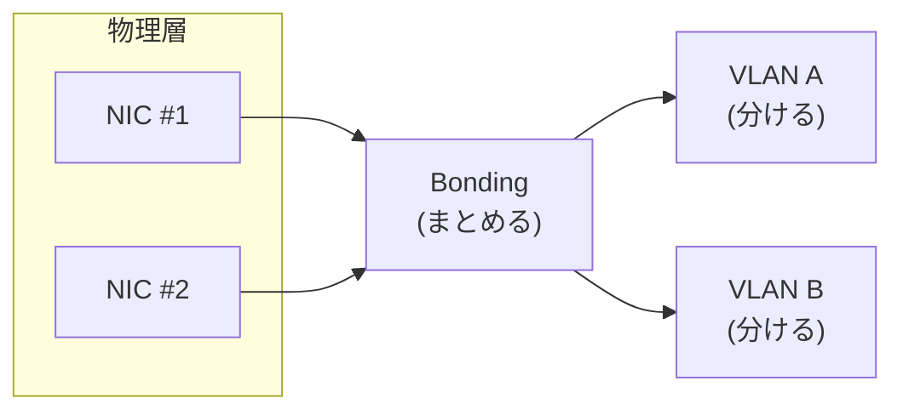
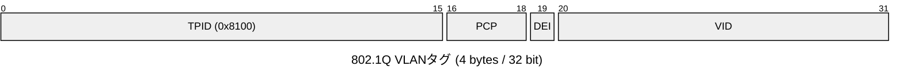
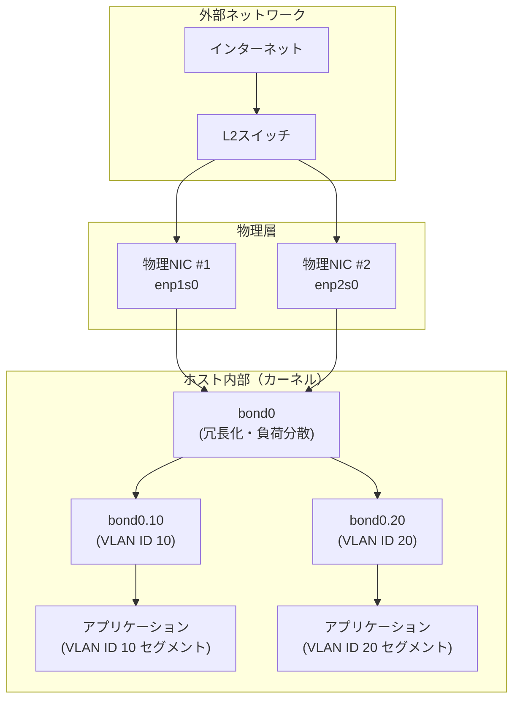

## はじめに

ネットワークについて学習しています。
「Bonding」と「VLAN」について認識を整理しました。

- **Bonding**: 複数の物理NICをまとめて一つの論理的なNICとして扱う
- **VLAN**: 一つのNICを複数の論理的なネットワークに分ける

いずれもOSI参照モデルのL2（データリンク層）で動作する技術です。IPアドレスより下のレイヤーで、Ethernetフレームの送受信を制御します。


```mermaid
graph LR
    subgraph 物理層
        NIC1["NIC #1"]
        NIC2["NIC #2"]
    end
    NIC1 --> BOND["Bonding<br/>(まとめる)"]
    NIC2 --> BOND
    BOND --> VLANA["VLAN A<br/>(分ける)"]
    BOND --> VLANB["VLAN B<br/>(分ける)"]
```

「物理をまとめる」「論理で分ける」を組み合わせることで、データセンターなどの実運用に近い構成になります。個人的には、複数のディスクをまとめて論理的に分割するLVMと同じイメージで捉えています。

この記事では、まずBondingとVLANの仕組みと用語を整理します。実際の検証は次回・次々回の記事に分けて行い、VLANタグ処理の責任をOS側に持たせる方式と、ブリッジ側に持たせる方式の両方を確認します。

## Bondingの仕組み

Bondingは、複数の物理NICを束ねて一つの論理的なNICとして扱う仕組みです。
主な目的は次の2つです。

- **冗長化**: 1本のケーブルやNICが故障しても通信を継続する
- **帯域確保・負荷分散**: 複数NICの帯域を束ねてスループットを向上させる

代表的な動作モードは以下の通りです。

| モード | 概要 |
|---|---|
| active-backup | 1本をアクティブ、残りをバックアップとして待機させる |
| 802.3ad (LACP) | 複数NICを束ねて負荷分散する（対向スイッチ側もLACP設定が必要） |
| balance-rr | ラウンドロビンでパケットを振り分ける |

nmcliで実践する場合、次のようなコマンドになります。

```bash
# bondタイプの論理的なNICをbond0として作成（LACPモード）
nmcli connection add type bond ifname bond0 con-name bond0 \
  mode 802.3ad

# 物理NICをbond0のポートとして追加
nmcli connection add type ethernet ifname enp1s0 controller bond0 port-type bond
nmcli connection add type ethernet ifname enp2s0 controller bond0 port-type bond

# bond0を起動
nmcli connection up bond0
```

これで`enp1s0`・`enp2s0`という2つの物理NICから受け取った情報を`bond0`という1つの論理NICに集約できます。

## VLANの仕組み

VLANは、1つの物理/論理NICの上に複数の独立したL2セグメントを作る仕組みです。
主な目的は次の2つです。

- **セグメントの分離**: 互いに通信できない複数のネットワークを作る
- **配線の削減**: 1本の物理NICに複数のVLANを相乗りさせる

これを実現する標準規格が802.1Qです。以降で頻出する用語を先に整理しておきます。

- **VLAN ID (VID)**: 各VLANを識別する番号、同じVIDを持つ機器同士だけが同一のL2セグメントとして通信できる
- **802.1Q**: VLAN IDをEthernetフレームに埋め込むための標準規格
- **VLANタグ**: 802.1Qに従ってフレームに付加される4バイトの情報
- **VLANサブインターフェース**: 物理/論理NICの上に作る、特定VLAN ID専用の仮想インターフェース

MACアドレスの直後に4バイト(32bit)のVLANタグが挿入されます。内訳は以下の通りです。


```mermaid
packet-beta
title 802.1Q VLANタグ (4 bytes / 32 bit)
0-15: "TPID (0x8100)"
16-18: "PCP"
19: "DEI"
20-31: "VID"
```

VID(12bit)がVLAN IDで、1〜4094が有効範囲になります。

nmcliで実践する場合、次のようなコマンドになります。

```bash
# enp1s0の上にVLAN ID 10のサブインターフェースを作成
nmcli connection add type vlan con-name vlan10 ifname enp1s0.10 \
  dev enp1s0 id 10
```

これで`enp1s0`という物理NICの上に、VLAN ID 10専用の`enp1s0.10`という論理NICを作成できます。

## Bonding × VLAN

BondingとVLANの組み合わせ方は、VLANサブインターフェースを作るとき、親（`dev`）に物理NICではなくbondタイプのインターフェースを指定するだけです。

```bash
# bond0の上にVLAN ID 10のサブインターフェースを作る
nmcli connection add type vlan con-name vlan10 ifname bond0.10 \
  dev bond0 id 10

# bond0の上にVLAN ID 20のサブインターフェースを作る
nmcli connection add type vlan con-name vlan20 ifname bond0.20 \
  dev bond0 id 20
```

これにより、「物理NIC2本 → bond0（冗長化） → bond0.10 / bond0.20（論理分離）」という積み重ね構造ができあがります。
外部から届いたフレームがどこで受信され、どこで集約・分離され、最終的にどこへ渡るのかを含めて図示すると次のようになります。


```mermaid
graph TD
    subgraph external["外部ネットワーク"]
        INTERNET["インターネット"] --> SWITCH["L2スイッチ"]
    end

    subgraph physical["物理層"]
        SWITCH --> NIC1["物理NIC #1<br/>enp1s0"]
        SWITCH --> NIC2["物理NIC #2<br/>enp2s0"]
    end

    subgraph host["ホスト内部（カーネル）"]
        NIC1 --> BOND["bond0<br/>(冗長化・負荷分散)"]
        NIC2 --> BOND
        BOND --> VLAN10["bond0.10<br/>(VLAN ID 10)"]
        BOND --> VLAN20["bond0.20<br/>(VLAN ID 20)"]
        VLAN10 --> APP1["アプリケーション<br/>(VLAN ID 10 セグメント)"]
        VLAN20 --> APP2["アプリケーション<br/>(VLAN ID 20 セグメント)"]
    end
```

冗長化はbond0が、論理分離はその下のVLANサブインターフェースが担い、役割がきれいに分かれています。
分離されたフレームは、それぞれのVLANサブインターフェースを通ってホスト内部のアプリケーションまで届きます。

## まとめ

- **Bonding**は「物理をまとめる」役割。
- **VLAN**は「論理で分ける」役割。

複数ディスクをまとめて論理的に分割するLVMと同じように、物理はBondingでまとめて論理はVLANで分ける構成が理解できました。
こういった設計が実運用で有効なのは、冗長化と論理分離という別レイヤーの要求を、それぞれ専用の仕組みに任せられるからだと言えそうです。

同じEthernetフレームでも、VLANタグ処理の責任を誰に持たせるかで検証の観点が変わります。次回以降は、この2つの方式をそれぞれ検証していきます。

## 参考

- [VLANサブインターフェースでVLAN分離を検証する](https://zenn.dev/0x69d/articles/20260722-vlan-subinterface-verification)
- [LinuxブリッジのVLAN Filteringでアクセスポートを作る](https://zenn.dev/0x69d/articles/20260722-linux-bridge-vlan-filtering)
