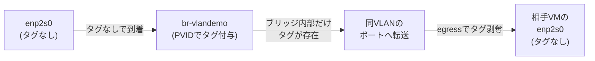
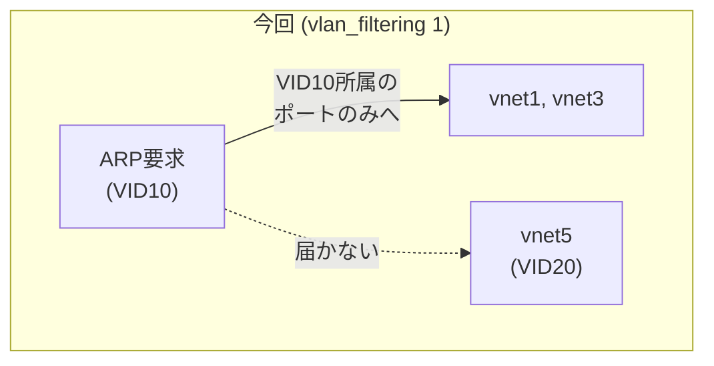

## はじめに

前回記事「[VLANサブインターフェースでVLAN分離を検証する](https://zenn.dev/0x69d/articles/20260722-vlan-subinterface-verification)」では、VLANタグの付与・剥奪は各VMのゲストOS側に任せていました。ブリッジはタグを一切見ない、という構成です。

ただ、実際データセンターなどではL2スイッチがポート単位でVLANを認識し、タグの処理を担うことが多いようです。そこで今回は「ブリッジがVLANを処理する」方式として、Linux Bridgeをアクセスポートのように扱う**VLAN Filtering**を試します。

環境は前回と同じ（`br-vlandemo` + `vlan-vm1`〜`vlan-vm3`）を使い回します。トランクポートの実装は用語とコマンド例の紹介にとどめます。

## VLAN Filteringとアクセスポート/トランクポート

先にVLAN Filtering特有の用語を整理しておきます。

- **PVID (Port VLAN ID)**: Ethernetフレーム受信時に割り当てるデフォルトのVLAN ID、ポートごとに設定する
- **アクセスポート**: 単一のVLANにのみ所属するポート
- **トランクポート**: 複数のVLANに所属するポート

## 検証環境の準備

前回記事の環境（`br-vlandemo` ブリッジ + `vlan-vm1`〜`vlan-vm3`）をそのまま使います。前回記事の「後片付け」を実施済みの場合は、同記事の手順でVMとブリッジを再構築してください。

今回はゲストOS側でVLANを扱わないため、各VMの`enp2s0`をフラットな状態に戻します。`vlan-vm1`・`vlan-vm2`では`vlan10`、`vlan-vm3`では`vlan20`というVLANサブインターフェース用のコネクションを削除し、親インターフェースに直接IPアドレスを設定します。

```bash
# VLANサブインターフェースのコネクションを削除
$ sudo nmcli connection delete vlan10

# 親インターフェース(enp2s0)に直接IPを設定
$ sudo nmcli connection modify "Wired connection 1" \
    ipv4.method manual ipv4.addresses 192.168.50.1/24 ipv6.method disabled
$ sudo nmcli connection up "Wired connection 1"
```

（`vlan-vm2`は`192.168.50.2/24`、`vlan-vm3`は接続名`vlan20`・IP`192.168.50.3/24`で同様に実行）

`vlan-vm1`での結果です。

```bash
$ nmcli connection show
NAME                UUID                                  TYPE      DEVICE
cloud-init enp1s0   a41601f3-3acc-5f60-ac5f-9d9011ab7c25  ethernet  enp1s0
Wired connection 1  b0f7af0e-dae8-38dd-973e-47783c575a4f  ethernet  enp2s0
lo                  ac6b4aa1-ac16-4cfc-9d0a-6754b079dd56  loopback  lo

$ ip -brief addr show enp2s0
enp2s0           UP             192.168.50.1/24
```

VLANサブインターフェース（`vlan10`）の接続が消え、`enp2s0`に直接IPアドレスが設定されています。これでゲストOS側はVLANを扱いません。

## ブリッジをVLAN Filteringモードにする

ホスト側で`br-vlandemo`の`vlan_filtering`を有効化します。

```bash
$ sudo ip link set br-vlandemo type bridge vlan_filtering 1
```

`ip -d link show`で有効化されたことを確認します。

```bash
$ ip -d link show br-vlandemo
18: br-vlandemo: <BROADCAST,MULTICAST,UP,LOWER_UP> mtu 1500 qdisc noqueue state UP mode DEFAULT group default qlen 1000
    link/ether ce:e9:38:e3:e0:a2 brd ff:ff:ff:ff:ff:ff promiscuity 0 allmulti 0 minmtu 68 maxmtu 65535
    bridge forward_delay 1500 hello_time 200 max_age 2000 ageing_time 30000 stp_state 0 priority 32768 vlan_filtering 1 vlan_protocol 802.1Q ...
```

有効化した直後の`bridge vlan show`を見ると、各VMのポート（`vnet1`=vlan-vm1、`vnet3`=vlan-vm2、`vnet5`=vlan-vm3）はまだすべて`PVID 1`のままです（他の仮想ブリッジのエントリは本題と無関係なため省略）。

```bash
$ bridge vlan show
port              vlan-id
br-vlandemo       1 PVID Egress Untagged
vnet1             1 PVID Egress Untagged
vnet3             1 PVID Egress Untagged
vnet5             1 PVID Egress Untagged
```

つまり、全ポートが同じVLAN(ID 1)に属した、1つのフラットなL2セグメントのままです。

ここからポートごとにVLANを割り当てて、初めて分離が可能になります。

## アクセスポートを設定する

各VMのポートを、目的のVLANのアクセスポートにします。

| VM | ポート | VLAN ID |
|---|---|---|
| vlan-vm1 | vnet1 | 10 |
| vlan-vm2 | vnet3 | 10 |
| vlan-vm3 | vnet5 | 20 |

```bash
# vlan-vm1・vlan-vm2のポートをVID10のアクセスポートに
$ sudo bridge vlan add dev vnet1 vid 10 pvid untagged
$ sudo bridge vlan del dev vnet1 vid 1
$ sudo bridge vlan add dev vnet3 vid 10 pvid untagged
$ sudo bridge vlan del dev vnet3 vid 1

# vlan-vm3のポートをVID20のアクセスポートに
$ sudo bridge vlan add dev vnet5 vid 20 pvid untagged
$ sudo bridge vlan del dev vnet5 vid 1
```

ブリッジの各ポートにpvidを設定しました。

`vid 1`を明示的に削除している点が重要です。各ポートにpvidを追加しただけだと、1ポートに2つのVLANが存在する不正な状態になってしまいます。この削除まで含めて1セットです。

設定後の状態です。

```bash
$ bridge vlan show
port              vlan-id
br-vlandemo       1 PVID Egress Untagged
vnet1             10 PVID Egress Untagged
vnet3             10 PVID Egress Untagged
vnet5             20 PVID Egress Untagged
```

## 疎通確認とブロードキャスト封じ込めの確認

### 同一VLAN間・異なるVLAN間の疎通確認

`vlan-vm1`(VID10)から`vlan-vm2`(VID10)へpingを打ちます。

```bash
$ ping -c 4 192.168.50.2
PING 192.168.50.2 (192.168.50.2) 56(84) bytes of data.
64 bytes from 192.168.50.2: icmp_seq=1 ttl=64 time=3.00 ms
64 bytes from 192.168.50.2: icmp_seq=2 ttl=64 time=3.36 ms
64 bytes from 192.168.50.2: icmp_seq=3 ttl=64 time=2.16 ms
64 bytes from 192.168.50.2: icmp_seq=4 ttl=64 time=1.35 ms

--- 192.168.50.2 ping statistics ---
4 packets transmitted, 4 received, 0% packet loss, time 3007ms
```

続いて`vlan-vm1`(VID10)から`vlan-vm3`(VID20)へ。

```bash
$ ping -c 4 -W 2 192.168.50.3
PING 192.168.50.3 (192.168.50.3) 56(84) bytes of data.
From 192.168.50.1 icmp_seq=1 Destination Host Unreachable
From 192.168.50.1 icmp_seq=2 Destination Host Unreachable
From 192.168.50.1 icmp_seq=3 Destination Host Unreachable

--- 192.168.50.3 ping statistics ---
4 packets transmitted, 0 received, +3 errors, 100% packet loss, time 3051ms
```

ゲストOS側はVLANサブインターフェースを一切持たない、ただの`enp2s0`だけの状態です。それでもブリッジ側の設定だけで、同一VLAN間は疎通し異なるVLAN間は疎通しませんでした。タグの処理責任がブリッジ側へ移っていることがわかります。

### アクセスポート上のフレームの確認

`vnet1`（vlan-vm1のアクセスポート）を、vlan-vm1→vlan-vm2のping中にtcpdumpで覗きます。

```bash
$ sudo tcpdump -e -nn -i vnet1 icmp
15:19:02.105324 52:54:00:e2:e3:f5 > 52:54:00:46:6e:d2, ethertype IPv4 (0x0800), length 98: 192.168.50.1 > 192.168.50.2: ICMP echo request, id 9889, seq 1, length 64
15:19:02.106677 52:54:00:46:6e:d2 > 52:54:00:e2:e3:f5, ethertype IPv4 (0x0800), length 98: 192.168.50.2 > 192.168.50.1: ICMP echo reply, id 9889, seq 1, length 64
15:19:03.108650 52:54:00:e2:e3:f5 > 52:54:00:46:6e:d2, ethertype IPv4 (0x0800), length 98: 192.168.50.1 > 192.168.50.2: ICMP echo request, id 9889, seq 2, length 64
15:19:03.109847 52:54:00:46:6e:d2 > 52:54:00:e2:e3:f5, ethertype IPv4 (0x0800), length 98: 192.168.50.2 > 192.168.50.1: ICMP echo reply, id 9889, seq 2, length 64
```

`ethertype IPv4 (0x0800)`とだけ表示され、802.1Qタグは付いていません。前回記事では同じ場所を覗いたとき`ethertype 802.1Q (0x8100), ... vlan 10`とタグ付きで観測されていました。ゲストOSが送信したフレームに、ブリッジがポートのPVID(10)でタグを付けて内部でVLAN10として転送している、ということがわかります。

フレームの視点で整理すると、次のようになります。



タグはブリッジ内部だけに存在しています。

### ブロードキャストの封じ込め

前回記事では、異なるVLAN宛のARPブロードキャストが、VID20側のポート(`vnet5`)まで届いていました。VLANタグは付いたまま届き、ゲストOS側にVID20のサブインターフェースがないため単に無視されていた、という状態です。

今回はブリッジ自身がVLANを認識しているため、そもそも異なるVLAN宛のARPブロードキャストは届かないはずです。



まず`vlan-vm1`のARPキャッシュを消してから`vlan-vm1`(VID10)→`vlan-vm2`(VID10)へpingを打ち、`vnet5`側をキャプチャします。

```bash
# vlan-vm1側で事前にARPキャッシュをクリア
$ sudo ip neigh flush dev enp2s0
```

```bash
$ sudo tcpdump -e -nn -i vnet5
```

このキャプチャ中に`vlan-vm1`から`vlan-vm2`へ`ping -c 4 192.168.50.2`を実行しましたが、`vnet5`では1パケットも観測されませんでした。ARP要求すら届いていません。

ブリッジ自身がポートの所属VLANを見てフラッディング対象を絞り込むため、無関係なVLANのポートにはフレームそのものが届きませんでした。このように無駄なブロードキャストを流さないことで、L2ネットワークの可用性や機密性を向上できます。

## おまけ: トランクポート

トランクポートは、複数のVLANに所属するポートです。アクセスポートではブリッジ内でVLANタグを付与していましたが、トランクポートではすでにVLAN タグが付与されているフレームを扱います。

設定方法はシンプルで、`pvid untagged`を付けずに複数のVLANを`bridge vlan add`するだけです。

```bash
# ポートをVID10/20両方を許可するトランクポートにする例
$ sudo bridge vlan add dev vnetX vid 10
$ sudo bridge vlan add dev vnetX vid 20
```

この場合、`vnetX`の先につながる機器（別のスイッチやルーターなど）は、自分自身でVLANタグを解釈できる必要があります。本記事ではアクセスポートとの対比として紹介するにとどめ、実演は行いません。

## まとめ

- ブリッジ自身がVLANタグの付与・剥奪の責任を持つ**VLAN Filtering**方式を扱いました
- **アクセスポート**はゲストOS側にVLANを一切意識させず、ブリッジのPVIDだけで分離を実現できます。
- VLAN Filteringが有効な状態では、異なるVLANのポートにそもそもブロードキャストが届きません。

ブリッジによるVLAN制御のメリットは、大規模なネットワークであるほど大きいと思います。

## 後片付け

検証に使ったVMとネットワークを削除する場合は、以下のコマンドを利用してください。

```bash
# VMを削除
for i in 1 2 3; do
  virsh destroy vlan-vm$i
  virsh undefine vlan-vm$i --nvram
done

# ボリュームを削除
for i in 1 2 3; do
  virsh vol-delete --pool default vlan-vm$i.qcow2
  virsh vol-delete --pool default vlan-vm$i-seed.img
done

# ブリッジを削除
sudo ip link delete br-vlandemo
```

## 参考

- [BondingとVLANでネットワークを設計する](https://zenn.dev/0x69d/articles/20260722-bonding-vlan-network-design)
- [VLANサブインターフェースでVLAN分離を検証する](https://zenn.dev/0x69d/articles/20260722-vlan-subinterface-verification)
