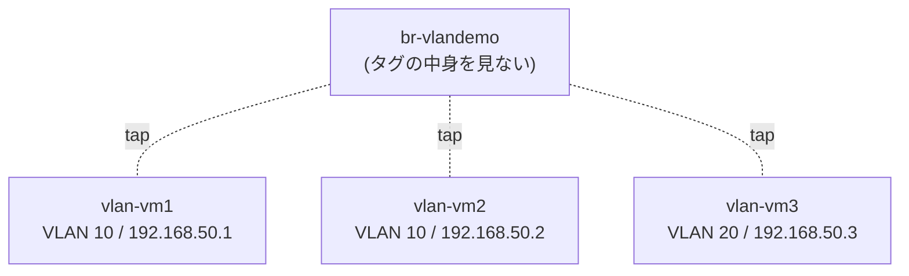
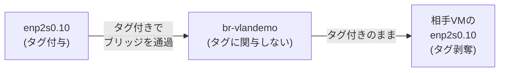

## はじめに

前回記事「[BondingとVLANでネットワークを設計する](https://zenn.dev/0x69d/articles/20260722-bonding-vlan-network-design)」で、BondingとVLANの仕組みと用語を整理しました。今回はそのうちVLANについて、実際にVMを使って分離を検証します。

VLANタグの付与・剥奪の責任は、ブリッジではなく各VMのゲストOS側（VLANサブインターフェース）に持たせます。次回の記事では、この責任をブリッジ側（VLAN Filtering）に持たせる方式を検証します。

## 実演環境の構築

ここから先は、実際にVMを使って検証します。検証はWSL2上のUbuntuで行いました。

### 検証環境

- ホストOS: Ubuntu 26.04 LTS
- libvirt: 12.0.0 / QEMU: 10.2.1
- ゲストOS: Fedora Linux 44 Cloud Edition（`nmcli`が標準搭載）

### 全体構成



> 図中の`tap`は「タップインターフェース」を指します。VMを起動するとlibvirtが`vnetX`という名前で自動生成する仮想インターフェースで、ホスト側から見るとVMの仮想NICはこのタップインターフェースとしてブリッジに接続されます。各VMの内部では、この検証用NICの上にVLANサブインターフェース（後述）を作ります。

設計方針は次の2点です。

- **ブリッジ（`br-vlandemo`）はVLANタグを一切意識しない**
- **VLANタグ処理の責務は各VMのゲストOS側に持たせる**

「ブリッジ＝VLANタグに関与しない」「VMのVLANサブIF＝VLANタグの処理担当」という役割分担になります。

### ブリッジを作る

まず、ホスト上に`br-vlandemo`というLinuxブリッジを1つ作ります。
Linuxブリッジは、ipコマンドで作成します。

```bash
$ sudo ip link add name br-vlandemo type bridge
$ sudo ip link set br-vlandemo up
```

作成できたか確認します。

```bash
$ ip -d link show br-vlandemo
18: br-vlandemo: <NO-CARRIER,BROADCAST,MULTICAST,UP> mtu 1500 qdisc noqueue state DOWN mode DEFAULT group default qlen 1000
    link/ether ce:e9:38:e3:e0:a2 brd ff:ff:ff:ff:ff:ff promiscuity 0 allmulti 0 minmtu 68 maxmtu 65535
    bridge forward_delay 1500 hello_time 200 max_age 2000 ageing_time 30000 stp_state 0 priority 32768 vlan_filtering 0 vlan_protocol 802.1Q ...
```

`state DOWN`になっていますが、ポート（VMのタップインターフェースなど）がまだ1つも接続されていないためで、正常な状態です。ポートが1つでも上がれば`state UP`に変わります。

### VMを3台作る

VMはvirt-installで用意します。ディスクイメージやシードイメージは以前の記事「[QEMU/KVM + libvirt 仮想化クイックガイド](https://zenn.dev/0x69d/articles/20260707-qemu-kvm-libvirt-quickstart)」を参照のうえ、別途用意してください。

ネットワーク部分に注意が必要です。各VMには2枚のNICを割り当てています。

- **NIC1**: SSHで使う管理用NIC → `default`ネットワーク
- **NIC2**: VLANで使う検証用NIC → `br-vlandemo`ブリッジ

```bash
$ virt-install \
    --name vlan-vm1 \
    --memory 1536 --vcpus 2 --cpu host-passthrough \
    --disk vol=default/vlan-vm1.qcow2,bus=virtio \
    --disk vol=default/vlan-vm1-seed.img,device=cdrom \
    --network network=default,model=virtio \
    --network bridge=br-vlandemo,model=virtio \
    --os-variant fedora-unknown \
    --graphics none --console pty,target_type=serial \
    --import --noautoconsole
```

これを`vlan-vm1`〜`vlan-vm3`の3台分実行しました。

```bash
$ virsh list --all
 Id   Name       State
--------------------------
 1    vlan-vm1   running
 2    vlan-vm2   running
 3    vlan-vm3   running

$ virsh domiflist vlan-vm1
 Interface   Type      Source        Model    MAC
-----------------------------------------------------------------
 vnet0       network   default       virtio   52:54:00:5c:67:ff
 vnet1       bridge    br-vlandemo   virtio   52:54:00:e2:e3:f5
```

`vlan-vm1`では、`vnet0`が管理用（`default`）、`vnet1`が検証用（`br-vlandemo`）のNICです。`Type`列が`bridge`になっている点が、libvirtのネットワークを経由せず直接ブリッジに接続していることを表しています。

これはあくまでホスト側から見た名前です。ゲストOS側ではどう見えるか、SSHでvlan-vm1に入って確認します。

```bash
$ ip -brief link show
lo               UNKNOWN        00:00:00:00:00:00 <LOOPBACK,UP,LOWER_UP>
enp1s0           UP             52:54:00:5c:67:ff <BROADCAST,MULTICAST,UP,LOWER_UP>
enp2s0           UP             52:54:00:e2:e3:f5 <BROADCAST,MULTICAST,UP,LOWER_UP>
```

MACアドレスを`virsh domiflist`の出力と照らし合わせると、`enp1s0`が管理用NIC、`enp2s0`が検証用NICだとわかります。

以降は、この`enp2s0`に対してVLANサブインターフェースを作っていきます。

## VLANサブインターフェースを作る

検証用NIC（`enp2s0`）にはIPアドレスを持たせません。代わりに`enp2s0`の上にVLANサブインターフェースを作り、そちらにIPアドレスを設定します。

| VM | VLAN ID | サブIF | IPアドレス |
|---|---|---|---|
| vlan-vm1 | 10 | enp2s0.10 | 192.168.50.1/24 |
| vlan-vm2 | 10 | enp2s0.10 | 192.168.50.2/24 |
| vlan-vm3 | 20 | enp2s0.20 | 192.168.50.3/24 |

vlan-vm1での設定例です（vlan-vm2は同じVLAN ID 10、vlan-vm3だけVLAN ID 20とIPアドレスを変えて同様に実行しました）。

```bash
# 事前に対象NICのコネクション名を確認する
$ nmcli connection show
NAME                UUID                                  TYPE      DEVICE
cloud-init enp1s0   a41601f3-3acc-5f60-ac5f-9d9011ab7c25  ethernet  enp1s0
Wired connection 1  b0f7af0e-dae8-38dd-973e-47783c575a4f  ethernet  enp2s0

# 親インターフェース(enp2s0)自体にはIPを持たせない
$ sudo nmcli connection modify "Wired connection 1" \
    ipv4.method disabled ipv6.method disabled
$ sudo nmcli connection up "Wired connection 1"

# VLAN ID 10のサブインターフェースを作成
$ sudo nmcli connection add type vlan con-name vlan10 \
    ifname enp2s0.10 dev enp2s0 id 10 \
    ipv4.method manual ipv4.addresses 192.168.50.1/24 \
    ipv6.method disabled
Connection 'vlan10' (d84b64fc-816c-41b2-8395-e2aa32b38f35) successfully added.

$ sudo nmcli connection up vlan10
Connection successfully activated

$ ip -brief addr show enp2s0.10
enp2s0.10@enp2s0 UP             192.168.50.1/24
```

`nmcli connection show`で見ると、VLAN関連の設定が親インターフェースと分離されているのがわかります。

```bash
$ nmcli connection show vlan10 | grep -E "vlan\.|ipv4\."
ipv4.method:                            manual
ipv4.addresses:                         192.168.50.1/24
vlan.parent:                            enp2s0
vlan.id:                                10
```

IPアドレスの設定と同時に、`192.168.50.0/24`宛のルートも自動生成されています。

```bash
$ ip route show dev enp2s0.10
192.168.50.0/24 proto kernel scope link src 192.168.50.1 metric 400
```

### 同一VLAN間の疎通確認

vlan-vm1（VID10, .1）からvlan-vm2（VID10, .2）へpingを打ちます。

```bash
$ ping -I enp2s0.10 -c 4 192.168.50.2
PING 192.168.50.2 (192.168.50.2) from 192.168.50.1 enp2s0.10: 56(84) bytes of data.
64 bytes from 192.168.50.2: icmp_seq=1 ttl=64 time=1.79 ms
64 bytes from 192.168.50.2: icmp_seq=2 ttl=64 time=2.23 ms
64 bytes from 192.168.50.2: icmp_seq=3 ttl=64 time=1.62 ms
64 bytes from 192.168.50.2: icmp_seq=4 ttl=64 time=1.85 ms

--- 192.168.50.2 ping statistics ---
4 packets transmitted, 4 received, 0% packet loss, time 3005ms
```

問題なく疎通しました。

### 異なるVLAN間の疎通確認

同じ手順で、vlan-vm1（VID10, .1）からvlan-vm3（VID20, .3）へpingを打ちます。

```bash
$ ping -I enp2s0.10 -c 4 -W 2 192.168.50.3
PING 192.168.50.3 (192.168.50.3) from 192.168.50.1 enp2s0.10: 56(84) bytes of data.
From 192.168.50.1 icmp_seq=1 Destination Host Unreachable
From 192.168.50.1 icmp_seq=2 Destination Host Unreachable
From 192.168.50.1 icmp_seq=3 Destination Host Unreachable
ping: sendmsg: No route to host

--- 192.168.50.3 ping statistics ---
4 packets transmitted, 0 received, +3 errors, 100% packet loss
```

同じサブネット・同じブリッジにいるにもかかわらず、VLAN IDが違うだけで疎通できませんでした。

`Destination Host Unreachable`はARP解決に失敗した際の応答です。この時点でvlan-vm1は、vlan-vm3のMACアドレスを解決できないことがわかります。

## tcpdumpでフレームを覗く

ここまでで「VLANで分離できている」ことは確認できましたが、ブリッジ自身がタグを見て何かを判断しているのか、実際にフレームを覗いて確認します。

キャプチャ対象は、ホスト上のvlan-vm1に対応するタップインターフェース`vnet1`です。ブリッジの中を流れるフレームをそのまま見ることができます。

### 同一VLAN間のフレームを見る

vlan-vm1からvlan-vm2へpingを打ちながら、ホスト側で`vnet1`をキャプチャしました。

```bash
$ sudo tcpdump -e -nn -i vnet1 icmp
listening on vnet1, link-type EN10MB (Ethernet), snapshot length 262144 bytes
10:29:51.159996 52:54:00:e2:e3:f5 > 52:54:00:46:6e:d2, ethertype 802.1Q (0x8100), length 102: vlan 10, p 0, ethertype IPv4 (0x0800), 192.168.50.1 > 192.168.50.2: ICMP echo request, id 9885, seq 8, length 64
10:29:51.161253 52:54:00:46:6e:d2 > 52:54:00:e2:e3:f5, ethertype 802.1Q (0x8100), length 102: vlan 10, p 0, ethertype IPv4 (0x0800), 192.168.50.2 > 192.168.50.1: ICMP echo reply, id 9885, seq 8, length 64
```

`ethertype 802.1Q (0x8100)`、`vlan 10`という表示から、確かに802.1Qタグが付いた状態でフレームがブリッジ内を流れていることが読み取れます。

### 異なるVLAN宛のフレームを見る

次に、vlan-vm1からvlan-vm3宛にpingを打ちながら、vlan-vm3側のタップ（`vnet5`）をキャプチャしました。

```bash
$ sudo tcpdump -e -nn -i vnet5 vlan or arp
listening on vnet5, link-type EN10MB (Ethernet), snapshot length 262144 bytes
10:30:09.438534 52:54:00:e2:e3:f5 > ff:ff:ff:ff:ff:ff, ethertype 802.1Q (0x8100), length 46: vlan 10, p 0, ethertype ARP (0x0806), Request who-has 192.168.50.3 tell 192.168.50.1, length 28
10:30:10.462489 52:54:00:e2:e3:f5 > ff:ff:ff:ff:ff:ff, ethertype 802.1Q (0x8100), length 46: vlan 10, p 0, ethertype ARP (0x0806), Request who-has 192.168.50.3 tell 192.168.50.1, length 28
10:30:11.485206 52:54:00:e2:e3:f5 > ff:ff:ff:ff:ff:ff, ethertype 802.1Q (0x8100), length 46: vlan 10, p 0, ethertype ARP (0x0806), Request who-has 192.168.50.3 tell 192.168.50.1, length 28
```

VID10のタグが付いたARP要求が、実際にvlan-vm3側のポートまで届いています。宛先がブロードキャストのため、ブリッジは中身のVLAN IDを気にせず、受信ポート以外の全ポートへそのままフラッディングしています。

それでもpingが失敗するのは、タグを処理しているのはvlan-vm3のゲストOS側にVLANタグ（VLAN ID10）に対応するサブインターフェースが存在しないためです。

### タグの見え方をまとめる

ここまでの検証をフレームの視点で整理すると、次のようになります。



VLANタグは送信元・宛先の両方のVLANサブインターフェースの間で存在し続け、ブリッジはその中身を一切見ていません。

## まとめ

- ブリッジ（`br-vlandemo`）はVLANタグを一切処理しませんでした。
- タグの処理はすべて各VMのゲストOS側（VLANサブインターフェース）が担いました。
- 同一VLAN間は疎通し、異なるVLAN間はARP解決に失敗して疎通しませんでした。tcpdumpでも、ブリッジ内をタグ付きのフレームがそのまま流れていることを確認できました。

次回の記事では、この役割をブリッジ側に持たせた場合の挙動を検証します。

## 後片付け

検証に使ったVMとネットワークを削除する場合は、以下のコマンドを利用してください。

```bash
# VMを削除
for i in 1 2 3; do
  virsh destroy vlan-vm$i
  virsh undefine vlan-vm$i --nvram
done

# ボリュームを削除
for i in 1 2 3; do
  virsh vol-delete --pool default vlan-vm$i.qcow2
  virsh vol-delete --pool default vlan-vm$i-seed.img
done

# ブリッジを削除
sudo ip link delete br-vlandemo
```

## 参考

- [BondingとVLANでネットワークを設計する](https://zenn.dev/0x69d/articles/20260722-bonding-vlan-network-design)
- [QEMU/KVM + libvirt 仮想化クイックガイド](https://zenn.dev/0x69d/articles/20260707-qemu-kvm-libvirt-quickstart)
- [Linux BridgeのVLAN Filteringでアクセスポート/トランクポートを実現する](https://zenn.dev/0x69d/articles/20260722-linux-bridge-vlan-filtering)
