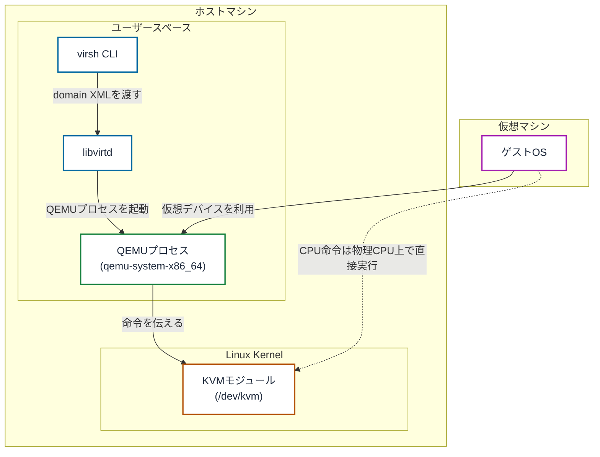

## はじめに

KVM・QEMU・libvirt。
これら3つの言葉がそれぞれ何を指していて、どう役割分担しているのか。
自分なりに整理してみます。

以前の記事では、実際に仮想化を実践しています。
こちらも試してもらえると理解が深まると思うので、よかったらご参照ください。
[QEMU/KVM + libvirt 仮想化クイックガイド](https://zenn.dev/0x69d/articles/20260707-qemu-kvm-libvirt-quickstart)

## 仮想化とはなにか

仮想化とは、1台の物理マシンの上で複数の独立したOS環境を動かす技術です。
この環境を**仮想マシン**（以下VM）と呼びます。

VMは、ホストOS上の1つのプロセスとして、ホストとは別のゲストOSを動かします。

## 仮想化の利点

VMが使うCPU・メモリは、結局のところ物理ホストのものです。
それでも、物理マシンをそのまま使う場合と比べて、VMには次のような利点があります。

- **リソース割り当ての柔軟性**: ソフトウェアによって計算リソースの割り当てを柔軟に制御できる
- **ソフトウェアによる構成管理**: VMの構成はすべてホスト上のデータ（domain XML）として保存され、ソフトウェアで制御できる
- **ホストからの分離**: ゲストOSはホストとは別のカーネルを持ち、独立した環境として動く
- **スペース・コストの効率化**: 1台の物理マシンが複数のゲストOSを動かせる

## ドメインとVMの違い

本題に入る前に、誤解をまねきやすい用語を整理します。
libvirtの操作や設定ファイルの文脈では、ドメインという用語が頻出します。
VMとの違いが気になる方もいるかもしれません。

結論としては、ほぼ同じものと考えて問題ありません。

- **VM**は仮想化技術全般における一般的な呼び方
- **ドメイン**はlibvirtがVMを管理・操作する際の単位

libvirtから見ると、1つのドメイン＝1台のVMであり、`virsh`で操作する対象は常にドメインとして扱われます。

この記事でも、一般的な説明では「VM」、libvirtの操作や設定ファイルの文脈では「ドメイン」と、文脈に合わせて使い分けます。

## VMを構成するコンポーネントとその連携

本題に入ります。
VMを起動するとき、内部では複数のソフトウェアが連携して動いています。

まず、前提となる用語をひとつ。

**ハイパーバイザー**とは、VMを作成・実行するための基盤となるソフトウェア層のことです。RHELのドキュメントでは、KVMモジュールと仮想化カーネルドライバーがこれにあたるとされています。つまりカーネル側の話です。

なお、QEMU/libvirtの文脈では、QEMUまで含めてハイパーバイザーと呼ぶこともあります（libvirt自身がこの組み合わせを "QEMU/KVM hypervisor driver" と呼んでいます）。呼び方に幅がある用語だと思っておくとよさそうです。

その上で、実際に動くソフトウェアをカーネルに近い側から順に整理します。

- **KVM**: Linuxのカーネルモジュールです。ホストのLinuxカーネルが仮想化用のリソースをユーザースペースのソフトウェアに提供できるようにします。具体的には、CPUが持つハードウェア仮想化支援機能（Intel VT-x / AMD-V）を`/dev/kvm`というインターフェース経由で使えるようにするものです。
- **QEMU**: ユーザースペースで動作するエミュレータです。ゲストOSが動作するための仮想的なハードウェアプラットフォームをまるごとシミュレートし、ホスト上のリソースをどう割り当ててゲストに見せるかを管理します。VM 1台につき1つの`qemu-system-*`プロセスが起動し、ゲストのメモリ領域を確保するのもこのプロセスです。ただしKVMと組み合わせた場合、CPU命令はエミュレートされず物理CPU上で直接実行されます。QEMU単体でも動作しますが、その場合はCPUもソフトウェアでエミュレートするため非常に低速になります。
- **libvirt**: QEMUを操作しやすくするための管理・抽象化レイヤーです。VMの設定・実行のための各種ツール（`virsh`など）を提供します。Red Hatは、不適切な設定がセキュリティ上の脆弱性を生みうるという理由から`qemu-*`コマンドを直接叩くことを推奨しておらず、libvirt経由で扱うのが基本です。
- **libvirtd**: libvirtの常駐デーモンです。`virsh`などのクライアントからの要求を受け取り、実際にQEMUプロセスを起動・管理します。ディストリビューションによっては、機能ごとに分割された`virtqemud`・`virtnetworkd`といったモジュラーデーモンがこの役割を担います。

これらに加えて、設定ファイルがひとつ登場します。

- **domain XML**: VMごとの設定を定義するXMLファイルです。VM名やタイムゾーンなどのメタデータ、CPU・メモリ・ディスク・ネットワークといった仮想的なハードウェア構成、再起動時の挙動などを1ファイルにまとめて記述します。

これらを踏まえて`virsh`によるVM操作の裏側を追うと、次のような流れになります。



1. `virsh define quickstart-vm.xml`などのコマンドでlibvirtにdomain XMLを渡す
2. libvirtdがそのドメインの内容を保持する
3. `virsh start quickstart-vm`を実行すると、libvirtdがdomain XMLの内容をもとに`qemu-system-x86_64`プロセスを起動する（アーキテクチャによって`qemu-system-aarch64`などに変わる点に注意）
4. QEMUプロセスはその命令をKVMモジュールに伝える
5. KVMは、命令の実行に必要なリソースをホストのカーネルに適切に割り当てさせる。またCPUのハードウェア仮想化支援機能を使い、ゲストのコードを物理CPU上で直接実行させる
6. QEMUは仮想CPU・仮想ディスク・仮想NICといった仮想ハードウェアを構成し、ゲストOSに提示する

## libvirtの接続タイプ

libvirtの**接続タイプ**についても触れておきます。

libvirtには大きく分けて2種類の接続タイプがあります。

- **システム接続（`qemu:///system`）**: VM管理に関する全機能にアクセスできる接続。利用にはroot権限、または`libvirt`グループへの所属が必要。
- **セッション接続（`qemu:///session`）**: root権限を持たないユーザーが、ローカルユーザーの権限内でVMを作成するための接続。手軽に使える一方で、多くの機能制限を伴う。

ローカル環境でVMを扱う上では、システム接続をデフォルトとしておいた方が便利です。
以下のコマンドでデフォルトに設定できます。

```bash
echo 'export LIBVIRT_DEFAULT_URI="qemu:///system"' >> ~/.bashrc
source ~/.bashrc
```

## まとめ

VMには、KVM・QEMU・libvirtという3層構造があります。
libvirtが`virsh`のような使いやすいインターフェースをユーザーに提供し、QEMUがVMごとのプロセスとして仮想ハードウェアを構成、そしてKVMがCPUのハードウェア仮想化支援機能をカーネル経由で提供する。
この関係を押さえておけば、何かおかしくなったときに「今の問題はどの層の話なのか」から調べ始められます。

## 参考

- [RHEL における仮想化の基本概念 - Red Hat Enterprise Linux 10 | Red Hat Documentation](https://docs.redhat.com/ja/documentation/red_hat_enterprise_linux/10/html/configuring_and_managing_linux_virtual_machines/basic-concepts-of-virtualization-in-rhel) を参考にしています
