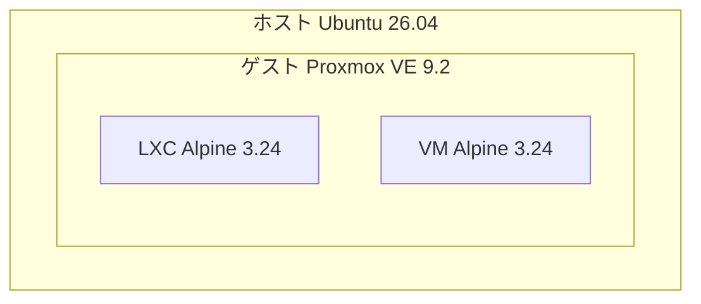

## はじめに

Proxmox VE（以下PVE）は、KVM/QEMUによる仮想マシンとLXCコンテナをWebブラウザから一元管理できる、Debianベースの仮想化プラットフォームです。名前はよく見かけるものの触ったことがなかったので、実際どんな感じなのかを確かめてみました。

とはいえ物理マシンを1台空けるのは大げさなので、手元のUbuntu機のQEMU/KVM上にVMを1台立てて、その中にインストールしています。ネストした仮想化になりますが、UIの雰囲気を掴む目的なら十分でした。

## 試した環境

PVEの中でさらにVMを動かすので、仮想化が3階層になります。



VMの中でさらにVMを動かすには、ホストのCPUが持つ仮想化支援機能をゲストからも使える状態（ネスト仮想化）になっている必要があります。有効かどうかは次で確認できます（Intelの場合）。

```bash
cat /sys/module/kvm_intel/parameters/nested
```

`Y`が返ればOKです。最近のディストリビューションでは既定で有効になっていることが多いようです。

## PVE用のVMを用意する

### インストールISOを入手する

PVEのインストーラは公式サイトから配布されています。

- [Proxmox Downloads](https://www.proxmox.com/en/downloads) → Proxmox Virtual Environment → ISO Installer

今回は`proxmox-ve_9.2-1.iso`（約1.6GB）を使いました。libvirtから読める場所に置いておきます。ホストのlibvirtが既定で使うのは`/var/lib/libvirt/images/`です。

```bash
sudo wget -O /var/lib/libvirt/images/proxmox-ve_9.2-1.iso \
  http://download.proxmox.com/iso/proxmox-ve_9.2-1.iso
```

### VMのディスクを用意する

PVE本体はインストール直後で約4GiBを使います。この上にVMやコンテナを作っていくぶんを見込んで、今回は32GiBを割り当てました。

ディスクイメージは事前に`qemu-img create`しておいてもよいのですが、`virt-install`の`--disk`に`size=`を付けるとその場で作ってくれるので、今回はそちらに任せています。形式をqcow2にしておくと実際に使った分だけホスト側のファイルが太っていくので、32GiBと指定してもホストのディスクを最初から32GiB使うわけではありません。

### VMを作る

```bash
virt-install --connect qemu:///system --name pve1 \
  --memory 8192 --vcpus 4 --cpu host-passthrough \
  --machine q35 --boot uefi \
  --disk path=/var/lib/libvirt/images/pve1.qcow2,format=qcow2,bus=virtio,size=32 \
  --cdrom /var/lib/libvirt/images/proxmox-ve_9.2-1.iso \
  --network network=default,model=virtio \
  --os-variant debian13 --video qxl --noautoconsole
```

ここでのポイントは`--cpu host-passthrough`です。ホストのCPUをそのままゲストに見せる設定で、これを忘れるとゲストからVT-x（`vmx`フラグ）が見えず、PVE上でVMを起動できません。

### インストーラの画面を開く

上のコマンドには`--noautoconsole`を付けているので、実行してもVMが起動するだけで画面は出てきません。インストーラを操作するには、別途コンソールを開きます。

```bash
sudo apt install virt-viewer
virt-viewer --connect qemu:///system pve1
```

`--noautoconsole`を外しておけば、`virt-install`がこのウィンドウを自動で開いてくれます（中で使われるのはvirt-viewerなので、いずれにせよインストールは必要です）。virt-managerを入れているなら、一覧からVMをダブルクリックしても同じ画面が出ます。

なお、libvirtはVMごとにVNCサーバを立てているので、VNCクライアントから直接繋ぐこともできます。ポートは次で確認できます。

```bash
virsh -c qemu:///system vncdisplay pve1
```

## インストール

ISOから起動すると、グラフィカル版とTerminal UI版が選べます。シリアルコンソール経由で使うためのエントリもあります。


インストーラはウィザード形式で、EULA → ディスク → ロケーション → パスワード → ネットワーク、と5画面ほど進むだけです。

ディスクのオプション画面では、ファイルシステムとしてext4・xfsのほかにZFSとbtrfsが選べます。ZFSとbtrfsに付いている RAID0 / RAID1 / RAIDZ-1 といったラベルは、複数のディスクをまとめて1つの領域として使うときの構成の指定です。RAID0は複数のディスクにデータを分散させて書く構成、RAID1は同じデータを複数のディスクに持たせる構成で、RAIDZ-1はZFS独自の、1本壊れても復元できる構成です。

つまりディスクを2本以上積んだマシンなら、OSを入れる段階でこうした構成まで決めてしまえるということになります。今回はディスクが1本だけなので、既定のext4のまま進めました。


ネットワークは、管理インターフェース・FQDN・IP・ゲートウェイ・DNSをここで確定させます。ここまで入れておけば、インストール後にコンソールへ戻ってこなくてもブラウザから繋がります。


最後に設定内容の一覧が出ます。ここまで数分です。


## Web UIを開く

インストールが終わると`https://<IP>:8006`でWeb UIが上がっています。証明書は自己署名なのでブラウザに怒られますが、そのまま進みます。

認証方式（Realm）が最初から選択式になっていて、既定の`Linux PAM`はホストのUnixユーザーそのものです。つまり初回は`root`とインストール時に決めたパスワードで入ります。


ログインすると、まずサブスクリプション未購入の警告が出ます。PVEは無償で全機能が使えますが、有償サブスクリプションの契約者向けに別のパッケージリポジトリ（Enterprise）が用意されていて、その案内です。ログインするたびに出ます。


左のツリーは「Datacenter → ノード → ゲスト/ストレージ」という階層です。今回はノード1台だけですが、PVEは複数のノードをクラスタとして束ねられるので、その最上位がDatacenterにあたります。

下の画像はノードのサマリー画面です。CPU・メモリ・ディスクの使用率とグラフ、カーネルバージョン、ブートモードなどが1画面に載っています。


## VMとコンテナを作る

右上の「Create VM」でウィザードが開きます。General / OS / System / Disks / CPU / Memory / Network / Confirm というタブ構成で、libvirtのdomain XMLに書くような内容がひととおり並んでいます。


VMとは別に、LXCコンテナも同じUIから作れます。テンプレートはPVEが配布していて、UIから直接ダウンロードできます。今回はAlpineのテンプレートを落としてコンテナを1台立てました。

VMとコンテナは左のツリーに並んで表示され、サマリー・コンソール・バックアップといったタブ構成も共通です。


コンソールはブラウザの中で開きます。VNCの画面をブラウザ上に表示するnoVNCという仕組みが使われていて、専用のVNCクライアントを入れなくてもVMのブート画面から追えます。以下はPVEの上で起動したAlpineのVMです。

ホスト → PVE → Alpine と3階層目の仮想化になりますが、`host-passthrough`のおかげでこの階層でもKVMによるハードウェア支援が効いています。


## ブラウザからシェルも叩ける

ノードのシェルもブラウザに出ます。

`grep -c vmx /proc/cpuinfo`が`8`を返しているので、ゲストの中でもVT-xが見えていることが確認できます。


## まとめ

触ってみて分かったことをまとめます。

- **インストールがWeb UIまで一直線**: ISOから5画面進むだけで、ブラウザから使える状態になります。インストール後にコンソールで設定を続ける必要がありません。
- **VMとコンテナが同じ画面にいる**: KVMのVMとLXCコンテナが、同じツリーに同じ操作体系で並びます。
- **ブラウザだけで完結する**: コンソールもシェルもブラウザで開くので、GUIクライアントもSSHも要りません。
- **ストレージの選択肢が広い**: インストーラの時点でZFSやbtrfsを、複数ディスクの構成込みで選べます。

一方で、細かい設定はCLIが必要になりそうなので、そのあたりもいずれ試そうと思います。

なお今回はVMの中に入れているので、ディスクI/Oは実機に比べて遅くなります。UIやコンテナの挙動を見るぶんには気になりませんでしたが、性能を評価する用途には向きません。

## 後片付け

ホスト側でVMを消せば元に戻ります。

```bash
virsh -c qemu:///system destroy pve1
virsh -c qemu:///system undefine pve1 --nvram
sudo rm -f /var/lib/libvirt/images/pve1.qcow2
```

## 参考

- [Proxmox VE Documentation Index](https://pve.proxmox.com/pve-docs/)
- [仮想化ってなに？（QEMU/KVM + libvirtの基本）](https://zenn.dev/0x69d/articles/20260803-virtualization-basic-concepts)
