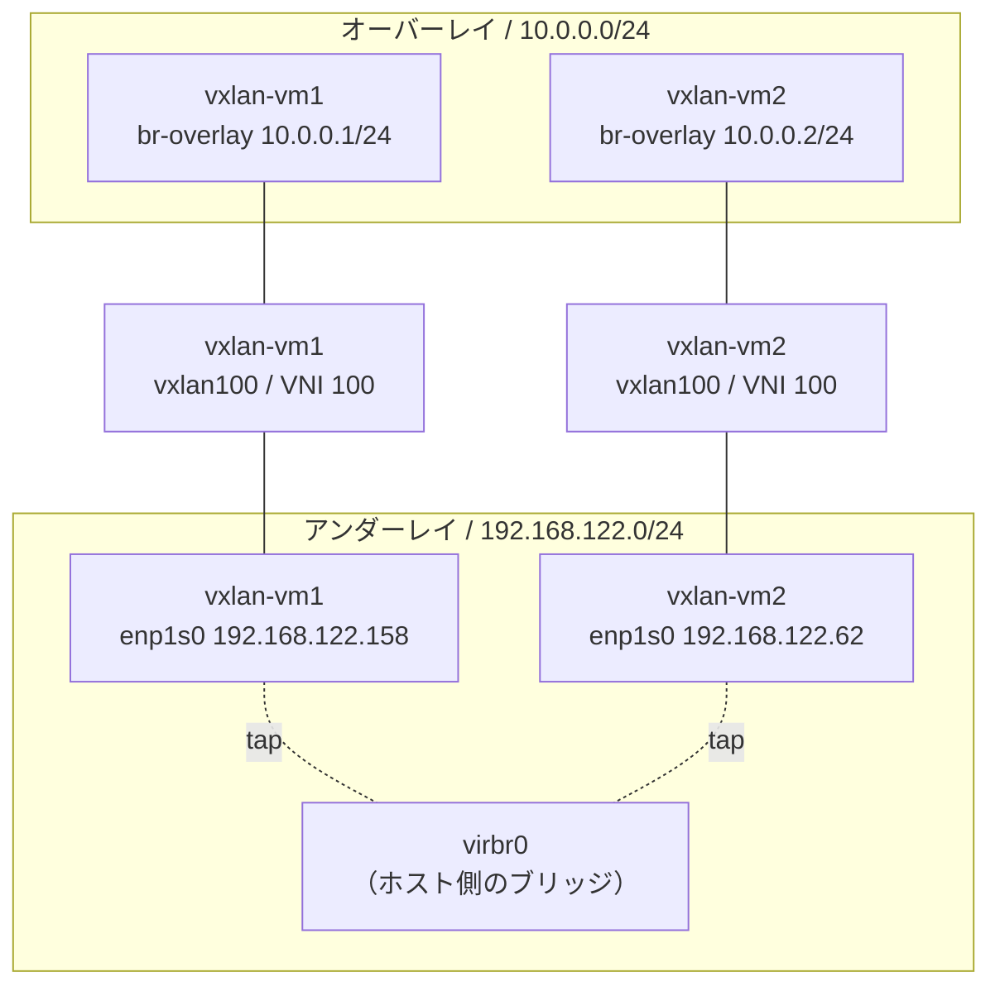
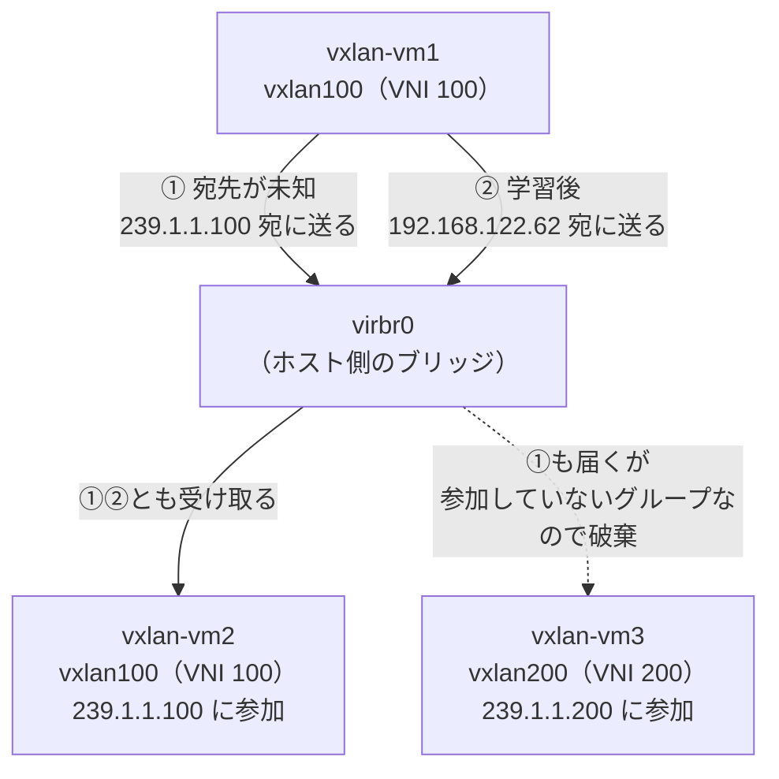
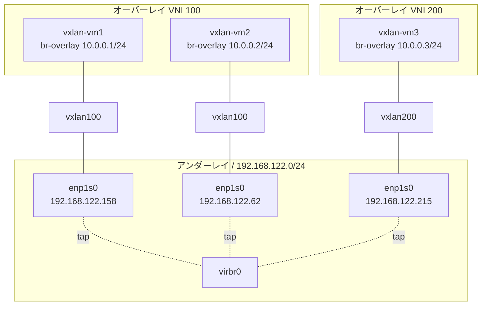
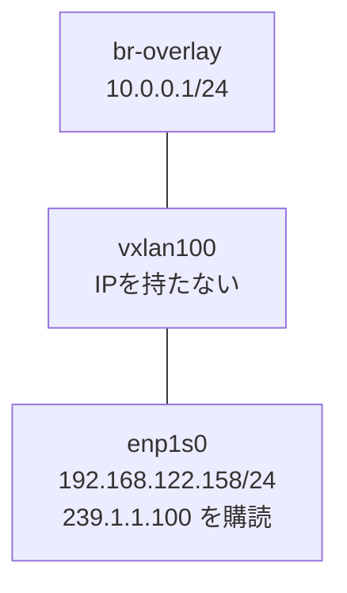

## はじめに

これまでの記事「[VLANサブインターフェースでVLAN分離を検証する](https://zenn.dev/0x69d/articles/20260722-vlan-subinterface-verification)」「[LinuxブリッジのVLAN Filteringでアクセスポートを作る](https://zenn.dev/0x69d/articles/20260722-linux-bridge-vlan-filtering)」では、VLANを使ってネットワークを分離しました。VLANは「経路上のスイッチすべてがVLANを理解している」ことを前提にした仕組みです。今回は、その前提を取り払うVXLANというオーバーレイ技術を、VM 3台を使って動かします。

## ホップバイホップ型とオーバーレイ型

ネットワークの分離技術は、識別子をどう運ぶかで2つに分けられます。

**ホップバイホップ型**は、元のフレームに識別子を挿し込みます。経路上のすべての機器がその識別子を解釈して転送を判断するので、1台でも設定が漏れればそこで通信が切れます。分離できる範囲は、物理的な配線と機器の設定に縛られます。

**オーバーレイ型**は、元のフレームを別のパケットで包みます。識別子を解釈するのは包む側と解く側の**両端だけ**で、間の機器は外側のヘッダしか見ません。中身を知る必要がないので、物理構成から独立できます。

VXLANは後者です。L2フレームをUDPパケットに包むため、間のネットワークから見ればただのIPパケットが流れているだけになります。識別子（VNI）は24ビットあり、約1677万個のネットワークを区別できます。

## アンダーレイとオーバーレイ

オーバーレイ型では、ネットワークが2層に分かれます。

- **アンダーレイ**: 実際にパケットが流れる土台のIPネットワーク。今回はlibvirtの`default`ネットワーク（`192.168.122.0/24`）
- **オーバーレイ**: その上に作られる仮想的なL2ネットワーク。今回は`10.0.0.0/24`

この2つのIPアドレス体系は完全に独立しています。オーバーレイ側から見ると、`10.0.0.1`と`10.0.0.2`は同じL2セグメントに直結しているように見えます。実際にはその通信はアンダーレイのIPパケットとして運ばれています。

## VXLANの用語

- **VTEP** (VXLAN Tunnel Endpoint): カプセル化・カプセル化解除を行う両端。今回は各VMがVTEPになる
- **VNI** (VXLAN Network Identifier): オーバーレイを識別する24ビットの番号。VLAN IDに相当する
- **カプセル化**: 元のL2フレームにVXLANヘッダを付け、UDP（標準ポート4789）とIPで包むこと

## 実演環境の構築

### 検証環境

- ホストOS: Ubuntu 26.04 LTS
- libvirt: 12.0.0 / QEMU: 10.2.1
- ゲストOS: Fedora Linux 44 Cloud Edition

### 全体構成

VM 3台を用意し、`vxlan-vm1`と`vxlan-vm2`をVNI 100、`vxlan-vm3`をVNI 200に所属させます。3台とも同じアンダーレイにいますが、VNIが違えば届かないことを確認するための構成です。

アドレスの対応は次のとおりです。オーバーレイ側は3台とも`10.0.0.0/24`という同じサブネットに置いています。

| VM | アンダーレイIP（`enp1s0`） | VNI | マルチキャストグループ | オーバーレイIP（`br-overlay`） |
| --- | --- | --- | --- | --- |
| vxlan-vm1 | 192.168.122.158 | 100 | 239.1.1.100 | 10.0.0.1/24 |
| vxlan-vm2 | 192.168.122.62 | 100 | 239.1.1.100 | 10.0.0.2/24 |
| vxlan-vm3 | 192.168.122.215 | 200 | 239.1.1.200 | 10.0.0.3/24 |

VLANの検証ではVMに2枚のNICを割り当てましたが、今回は1枚だけです。VXLANはアンダーレイのIP到達性さえあれば張れるので、管理用の`default`ネットワークをそのままアンダーレイとして使えます。

### VMを3台作る

VMはvirt-installで用意します。ディスクイメージやシードイメージは以前の記事「[QEMU/KVM + libvirt 仮想化クイックガイド](https://zenn.dev/0x69d/articles/20260707-qemu-kvm-libvirt-quickstart)」を参照のうえ、別途用意してください。

```bash
$ virt-install \
    --name vxlan-vm1 \
    --memory 1536 --vcpus 2 --cpu host-passthrough \
    --disk vol=images/vxlan-vm1.qcow2,bus=virtio \
    --disk vol=images/vxlan-vm1-seed.img,device=cdrom \
    --network network=default,model=virtio \
    --os-variant fedora-unknown \
    --graphics none --console pty,target_type=serial \
    --import --noautoconsole
```

これを`vxlan-vm1`〜`vxlan-vm3`の3台分実行しました。割り当てられたIPアドレスは`virsh net-dhcp-leases`で確認できます。

```bash
$ virsh net-dhcp-leases default
 Expiry Time           MAC address         Protocol   IP address           Hostname
------------------------------------------------------------------------------------
 2026-08-06 12:05:37   52:54:00:6f:16:64   ipv4       192.168.122.158/24   vxlan-vm1
 2026-08-06 12:05:44   52:54:00:d2:ed:fe   ipv4       192.168.122.62/24    vxlan-vm2
 2026-08-06 12:05:44   52:54:00:44:91:ea   ipv4       192.168.122.215/24   vxlan-vm3
```

この時点でVM同士はアンダーレイ経由で普通に通信できます。これがVXLANを張るための前提条件です。vxlan-vm1からvxlan-vm2のアンダーレイIPへpingを打ちます。

```bash
$ ping -c 2 192.168.122.62
2 packets transmitted, 2 received, 0% packet loss, time 1004ms
```

## VXLANインターフェースを作る

ここからは各VMにログインして作業します。VMごとに作るものは次の2つです。

- **VXLANインターフェース**（`vxlan100`）: カプセル化・カプセル化解除を担当する。VTEPの実体
- **ブリッジ**（`br-overlay`）: オーバーレイ側のL2セグメント

これらが既存の`enp1s0`とどう繋がるのかを図にすると、次のようになります。



2つの箱が、そのまま2つの層です。

- **オーバーレイ**: `10.0.0.0/24`のL2セグメント。VM同士が直結しているように見える世界
- **アンダーレイ**: `192.168.122.0/24`のIPネットワーク。実際にパケットが流れる土台

VTEPの実体は`vxlan100`というVXLANインターフェースです。`br-overlay`側から来たフレームを`vxlan100`が受け取ってUDPパケットに包み、`enp1s0`へ渡す。逆に`enp1s0`からUDPパケットが届いたら`vxlan100`は包みを解いて`br-overlay`へ流す。

`10.0.0.1`から`10.0.0.2`へのpingは、この図を上から下へ降りてvirbr0を渡り、また上へ登っていくことになります。virbr0にとっては、ただのUDPパケットが1つ通り過ぎるだけです。

### インターフェースを作成する

まずvxlan-vm1にログインし、VXLANインターフェースを作ります。

```bash
$ sudo ip link add vxlan100 type vxlan id 100 \
    group 239.1.1.100 dev enp1s0 dstport 4789
```

引数が多いので、ひとつずつ見ていきます。

| 引数 | 意味 |
| --- | --- |
| `vxlan100` | インターフェース名。任意の名前でよいが、VNIを含めると分かりやすい |
| `type vxlan` | VXLANインターフェースとして作る |
| `id 100` | VNI。このインターフェースがどのオーバーレイに属するかを決める |
| `group 239.1.1.100` | 宛先が分からないフレームを送るマルチキャストグループ（後述） |
| `dev enp1s0` | カプセル化したパケットを送り出すアンダーレイ側のNIC |
| `dstport 4789` | カプセル化に使うUDPポート番号。VXLANの標準値 |

`dev enp1s0`が「アンダーレイ側」を指している点が重要です。このインターフェースは、オーバーレイのフレームを受け取ったら、それをUDPパケットに包んで`enp1s0`から送り出します。逆に`enp1s0`にUDP 4789番のパケットが届いたら、包みを解いて中のフレームを取り出します。

### なぜマルチキャストグループが要るのか

`group`だけは、他の引数と性質が違います。これは「宛先が分からないときにどうするか」を決める設定です。



VXLANインターフェースが「このMACアドレスは、あのVTEPの向こうにいる」と知っていれば、②のようにそのVTEPへユニキャストで送れば済みます。しかし通信の最初、たとえばARPリクエストを送る時点では、相手がどのVTEPにいるか分かりません。物理的なスイッチであれば全ポートにフラッディングすればよいのですが、VXLANの「ポート」はIPネットワークの向こう側にあり、そもそも誰がいるのかも分かりません。

そこで①のように、宛先の分からないフレームはマルチキャストグループ宛に送ります。同じグループに参加しているVTEPだけがそれを受け取るので、これがフラッディングの代わりになります。ここでは同じVNIには同じグループを使い、VNIが違えば別のグループにしているので、`vxlan-vm3`はこのパケットを受け取りません。グループがVNIごとの分離をそのまま実現しています。

マルチキャストが必要なのは、宛先が分からない最初だけです。学習が済んだ後は②の経路になります。

### ブリッジに収容してIPを振る

次に、オーバーレイ側のブリッジを作り、そこにVXLANインターフェースを収容します。

```bash
$ sudo ip link add name br-overlay type bridge
$ sudo ip link set vxlan100 master br-overlay
```

VXLANインターフェースに直接IPを振ることもできますが、ブリッジを挟むとオーバーレイを「L2セグメント」として扱えます。このブリッジにvethやVMのtapを追加すれば、そのままオーバーレイの住人を増やせるという構造です。今回はブリッジ自身にIPを振って、VM本体をオーバーレイの住人にします。

```bash
$ sudo ip addr add 10.0.0.1/24 dev br-overlay
$ sudo ip link set vxlan100 up
$ sudo ip link set br-overlay up
```

### 残りの2台を設定する

vxlan-vm2とvxlan-vm3でも、同じ手順を値だけ変えて実行します。

| VM | VNI（`id`） | グループ（`group`） | IPアドレス |
| --- | --- | --- | --- |
| vxlan-vm1 | 100 | 239.1.1.100 | 10.0.0.1/24 |
| vxlan-vm2 | 100 | 239.1.1.100 | 10.0.0.2/24 |
| vxlan-vm3 | 200 | 239.1.1.200 | 10.0.0.3/24 |

vxlan-vm3だけVNIとグループが異なるので、インターフェース名も`vxlan200`にしました。

### できあがった構成を確認する

3台分をまとめると、次の構成ができあがりました。



アンダーレイは1つですが、その上に独立したオーバーレイが2つ載っています。3台とも同じ`virbr0`にぶら下がり、オーバーレイのIPも同じ`10.0.0.0/24`から採っているにもかかわらず、VNIが違うvxlan-vm3だけは別世界にいます。

vxlan-vm1で実際に確認します。まずインターフェースの一覧です。

```bash
$ ip -brief link
lo               UNKNOWN        00:00:00:00:00:00 <LOOPBACK,UP,LOWER_UP>
enp1s0           UP             52:54:00:6f:16:64 <BROADCAST,MULTICAST,UP,LOWER_UP>
vxlan100         UNKNOWN        ba:c0:0b:59:1e:a8 <BROADCAST,MULTICAST,UP,LOWER_UP>
br-overlay       UP             ba:c0:0b:59:1e:a8 <BROADCAST,MULTICAST,UP,LOWER_UP>
```

先ほどの図の3つがそのまま並んでいます。`vxlan100`と`br-overlay`のMACアドレスが同じなのは、ブリッジが最初に収容したポートのMACアドレスを引き継ぐためです。

`vxlan100`の詳細も見ておきます。

```bash
$ ip -d link show vxlan100
3: vxlan100: <BROADCAST,MULTICAST,UP,LOWER_UP> mtu 1450 qdisc noqueue master br-overlay state UNKNOWN mode DEFAULT group default qlen 1000
    link/ether ba:c0:0b:59:1e:a8 brd ff:ff:ff:ff:ff:ff promiscuity 1 allmulti 1 minmtu 68 maxmtu 65535
    vxlan id 100 group 239.1.1.100 dev enp1s0 srcport 0 0 dstport 4789 ttl auto ageing 300 ...
```

3行目に`vxlan id 100`、`group 239.1.1.100`、`dev enp1s0`、`dstport 4789`が指定どおりに入っています。1行目の`master br-overlay`は、このインターフェースが`br-overlay`に収容されていることを表します。

### アドレスはどこに付いているのか

VMのNICは`enp1s0`の1枚だけですが、ここまでで`192.168.122.158`・`10.0.0.1`・`239.1.1.100`という3つのアドレスが出てきました。1枚のNICが3つ持っているわけではなく、次のように分かれています。



| アドレス | 付いている先 | 種類 | パケットのどこに現れるか |
| --- | --- | --- | --- |
| `192.168.122.158/24` | `enp1s0` | ユニキャストIP | 外側ヘッダの送信元 |
| `239.1.1.100` | `enp1s0` | マルチキャストグループへの参加 | 外側ヘッダの宛先（宛先が未知のとき） |
| `10.0.0.1/24` | `br-overlay` | ユニキャストIP | 内側フレームの送信元 |
| （なし） | `vxlan100` | ブリッジのポートなのでIPを持たない | — |

物理的なNICは1枚でも、その上にソフトウェアでインターフェースを積んだので、IPもその分だけ増えたという構造です。

ユニキャストIPと、参加しているマルチキャストグループは、別のコマンドで確認します。

```bash
$ ip -4 -brief addr
lo               UNKNOWN        127.0.0.1/8
enp1s0           UP             192.168.122.158/24
br-overlay       UP             10.0.0.1/24

$ ip maddr show enp1s0 | grep inet
	inet  239.1.1.100
	inet  224.0.0.252
	inet  224.0.0.1
```

`239.1.1.100`が`ip addr`ではなく`ip maddr`に出るのは、これがアドレスではなく購読の登録だからです。ユニキャストIPが「自分の住所」なのに対し、マルチキャストアドレスは「聞き耳を立てているチャンネル」にあたります。vxlan-vm2でも同じ`239.1.1.100`が出てきます。

ルーティングは、IPを付けた時点で用意ができています。

```bash
$ ip route show
default via 192.168.122.1 dev enp1s0 proto dhcp src 192.168.122.158 metric 100
10.0.0.0/24 dev br-overlay proto kernel scope link src 10.0.0.1
192.168.122.0/24 dev enp1s0 proto kernel scope link src 192.168.122.158 metric 100
```

`proto kernel`の2行が、`ip addr add`したときにカーネルが自動生成したものです。オーバーレイもアンダーレイも同一サブネット内の通信なので、これ以外の設定は要りません。

このテーブルに`vxlan100`が出てこない点も、2つの層が独立していることの現れです。`10.0.0.2`宛のパケットは「`br-overlay`へ」で判断が終わり、そこから先のカプセル化と`enp1s0`からの送出は、ルーティングテーブルの外側で起きます。

## 疎通確認

vxlan-vm1から、同じVNIのvxlan-vm2と、VNIが異なるvxlan-vm3へpingを打ちます。

```bash
$ ping -c 3 10.0.0.2
3 packets transmitted, 3 received, 0% packet loss, time 2046ms

$ ping -c 2 -W 2 10.0.0.3
2 packets transmitted, 0 received, 100% packet loss, time 1047ms
```

`10.0.0.3`は同じ`10.0.0.0/24`のアドレスで、しかもアンダーレイ的には同じ`virbr0`にぶら下がっています。それでも届かないのは、VNIが違えば別のオーバーレイだからです。**VNIが分離の単位**であることがわかります。

## カプセル化とMACの学習を覗く

オーバーレイの通信がアンダーレイをどう流れているかを見たいので、キャプチャはVMの中ではなく、アンダーレイ側であるホストの`virbr0`で行います。vxlan-vm1のARPキャッシュをクリアしてからpingを打つと、ARPの解決から順に観察できます。

```bash
$ sudo tcpdump -i virbr0 -nn -vv "udp port 4789"
```

まず1発目、`10.0.0.2`のMACアドレスを問い合わせるARPリクエストです。

```
IP (tos 0x0, ttl 1, id 39648, offset 0, flags [none], proto UDP (17), length 78)
    192.168.122.158.45952 > 239.1.1.100.4789: VXLAN, flags [I] (0x08), vni 100
ARP, Ethernet (len 6), IPv4 (len 4), Request who-has 10.0.0.2 tell 10.0.0.1, length 28
```

3行が入れ子になっています。1行目がアンダーレイのIP/UDPパケット、2行目がVNI 100というVXLANヘッダ、3行目が本来のARPフレームです。**L2のブロードキャストがIPパケットの中に包まれて運ばれている**ことが、この出力に現れています。宛先が`239.1.1.100`、つまりマルチキャストグループになっているのは、この時点では`10.0.0.2`がどのVTEPにいるか分からないからです。

ARPリプライが返った後のICMPを見ると、外側の宛先が変わっています。

```
IP (tos 0x0, ttl 64, id 12637, offset 0, flags [none], proto UDP (17), length 134)
    192.168.122.158.55990 > 192.168.122.62.4789: VXLAN, flags [I] (0x08), vni 100
IP (tos 0x0, ttl 64, id 37300, offset 0, flags [DF], proto ICMP (1), length 84)
    10.0.0.1 > 10.0.0.2: ICMP echo request, id 57766, seq 1, length 64
```

グループ宛から`192.168.122.62`宛のユニキャストになりました。ARPリプライが返ってきたことで、vxlan-vm1は「あのMACアドレスは`192.168.122.62`というVTEPの向こうにいる」と学習したのです。この結果はFDB（転送テーブル）に記録されています。

```bash
$ bridge fdb show dev vxlan100 | grep self
5e:79:5e:b7:6a:58 dst 192.168.122.62 self
00:00:00:00:00:00 dst 239.1.1.100 via enp1s0 self permanent
```

`self`はVXLANインターフェース自身が持つエントリ、つまりVTEPの転送先を表します。1行目が学習済みのMACとその転送先、2行目が「宛先MACが未知ならマルチキャストグループへ送る」という既定のルールです。先に図で見た①と②が、パケットとテーブルの両方に現れました。

VXLANは通信を実際に流しながら、どのMACがどのVTEPの向こうにいるかを覚えていきます。疎通確認で`10.0.0.3`に届かなかったのは、別グループのvxlan-vm3までARPリクエストが到達していなかったからです。

## マルチキャストが動く条件

今回マルチキャストが問題なく動いたのは、アンダーレイが同一ホスト上のLinuxブリッジ（`virbr0`）だからです。

```bash
$ cat /sys/class/net/virbr0/bridge/multicast_querier
0
```

IGMPクエリアが不在のため、ブリッジはマルチキャストを全ポートにフラッディングしています。結果としてグループ宛のパケットが全VMに届きました。

物理ネットワークを跨ぐ場合は事情が変わります。ルータを越えてマルチキャストを届けるにはPIMなどのマルチキャストルーティングが必要で、これは運用の負担が大きい仕組みです。そのため実務では、転送先を手動で列挙するhead-end replicationや、BGP EVPNで制御プレーンを持たせる構成が使われます。VXLANの話にBGP EVPNが必ず付いてくるのは、この「宛先が分からないフレームをどう配るか」という問題が背景にあります。

## まとめ

- VLANが経路上のすべてのスイッチに設定を要求するのに対し、VXLANは両端のVTEPだけを設定すればよい
- アンダーレイ（IPネットワーク）とオーバーレイ（仮想L2）は独立していて、間の機器は中身を知らない
- 分離の単位はVNIで、同じサブネット・同じアンダーレイにいてもVNIが違えば届かない
- MACの学習はデータプレーンで行われ、未知の宛先はマルチキャストグループへ、学習後はVTEPへユニキャストで送られる

## 後片付け

```bash
# VMを削除
virsh destroy vxlan-vm1 && virsh undefine vxlan-vm1
virsh destroy vxlan-vm2 && virsh undefine vxlan-vm2
virsh destroy vxlan-vm3 && virsh undefine vxlan-vm3

# ボリュームを削除
virsh vol-delete --pool images vxlan-vm1.qcow2
virsh vol-delete --pool images vxlan-vm2.qcow2
virsh vol-delete --pool images vxlan-vm3.qcow2

# シードイメージを削除
virsh vol-delete --pool images vxlan-vm1-seed.img
virsh vol-delete --pool images vxlan-vm2-seed.img
virsh vol-delete --pool images vxlan-vm3-seed.img
```

## 参考

- [RFC 7348 - Virtual eXtensible Local Area Network (VXLAN)](https://datatracker.ietf.org/doc/html/rfc7348)
- [ip-link(8) - Linux manual page](https://man7.org/linux/man-pages/man8/ip-link.8.html)
- [bridge(8) - Linux manual page](https://man7.org/linux/man-pages/man8/bridge.8.html)
